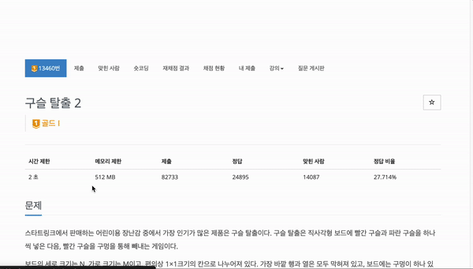
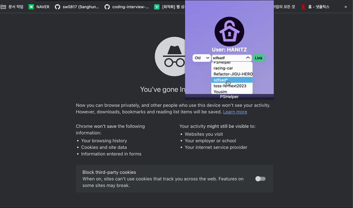

<h1 align="center">
  
  <p style="font-weight: 700;" >PSHelper</p>
<p align="center">
  <a href="LICENSE"></a>
</a>
</p>
</h1>

<!--- 소개 --->

## PSHelper?

<p>
  PSHelper는 PS역량을 기르고 싶은 사람들이 알고리즘 문제를 풀 때 보다 효과적으로 학습할 수 있도록 도와주는 것을 목표로 하는 크롬 익스텐션 프로그램입니다.
  <br>
  <em style="opacity:0.5; font-size: 13px;" >PSHelper는 코딩테스트 준비에 개인 풀이를 github에 자동 푸시해주는 <a href="https://github.com/QasimWani/LeetHub">LeetHub</a>, <a href="https://github.com/BaekjoonHub/BaekjoonHub">백준허브</a>를 참고하여 만든 개인프로젝트 입니다.</em>
</p>

<br/>
<hr/>
<br/>

# 기능 목록

<p style="font-weight: 700; font-size: 20px" >타이머</p>
</hr>
 :문제에 접근하면 자동으로 타이머가 바로 시작됩니다. 사용자는 타이머를 따로 조작할 수 없기 때문에 정확한 풀이 시간을 알 수 있습니다.(코딩테스트 대비)

</br>
<p style="font-weight: 700; font-size: 20px" >깃허브 자동 푸시</p>
</hr>
 :문제 제출 후 통과가 되었을 때, 등록되어진 깃허브 레포지토리에 풀이 코드가 자동으로 푸시됩니다.

</br>
</hr>

# 구현 예정 기능

<p style="font-weight: 700; font-size: 20px" >효율성 분석</p>
</hr>
 :문제풀이 통과 후 다른 사용자들의 풀이를 모아 그래프로 시간복잡도, 공간복잡도 분포를 나타내고 나의 풀이가 어느 정도의 코드 효율성을 가졌는지 바로 알 수 있도록 알려줍니다.

</br>
</br>
<div align="center">프로그래머스 동작 화면</div>
<br/>


<div align="center">백준 동작 화면</div>
<br/>



</br>

# 사용 방법

<p style="font-size:15px;" >1. PSHelper 설치 후, Extensions에서 PSHelper를 클릭합니다.</p>


<p style="font-size:15px;" >2. 로고를 클릭하고 깃허브 계정 로그인을 해주세요. 풀이 코드 자동 푸시를 위해 깃허브 요청권한이 필요합니다.</p>


<p style="font-size:15px;" >3.  다시 Extensions에서 PSHelper를 클릭합니다. 코드 자동 푸시에 사용될 레포지토리를 선택해주세요. 새로운 레포지토리 생성을 원하면 New, 기존 레포지토리를 선택하고 싶으면 Old를 선택해주세요.</p>


<p style="font-size:15px;" >4.레포지 선택이 완료되면 현재 설정된 레포지토리 이름과 Option 창을 볼 수 있습니다. 레포지토리 이름을 클릭하면 다시 레포지토리를 선택하는 과정이 진행됩니다. Option에서는 깃허브 자동푸시와 자동타이머를 설정할 수 있습니다. </p>



## 로컬 환경에서 작동 방법

1. 레포지토리를 로컬환경에 포크하거나 클론해주세요.

```sh
$ npm run build # 2. dist폴더가 생성됩니다.
```

3. Extensions의 우측상단에 있는 개발자 모드를 활성화해주세요.
4. 'Load unpacked'를 클릭하고 빌드폴더 dist를 선택하면 실행됩니다.

<br />
